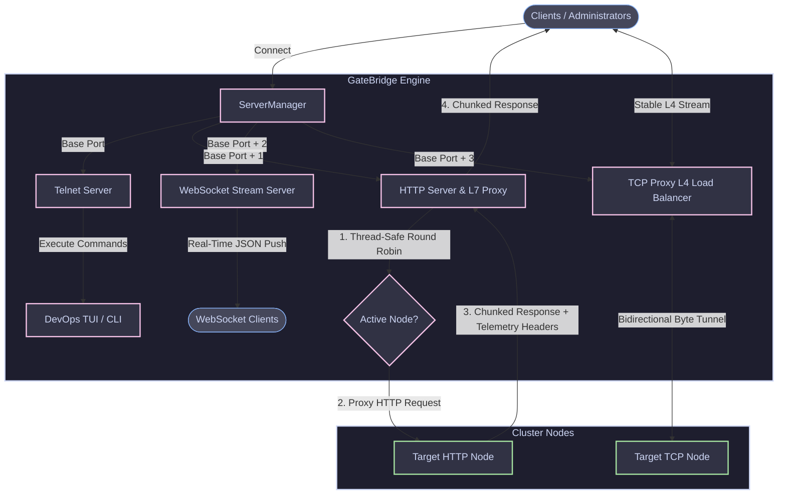
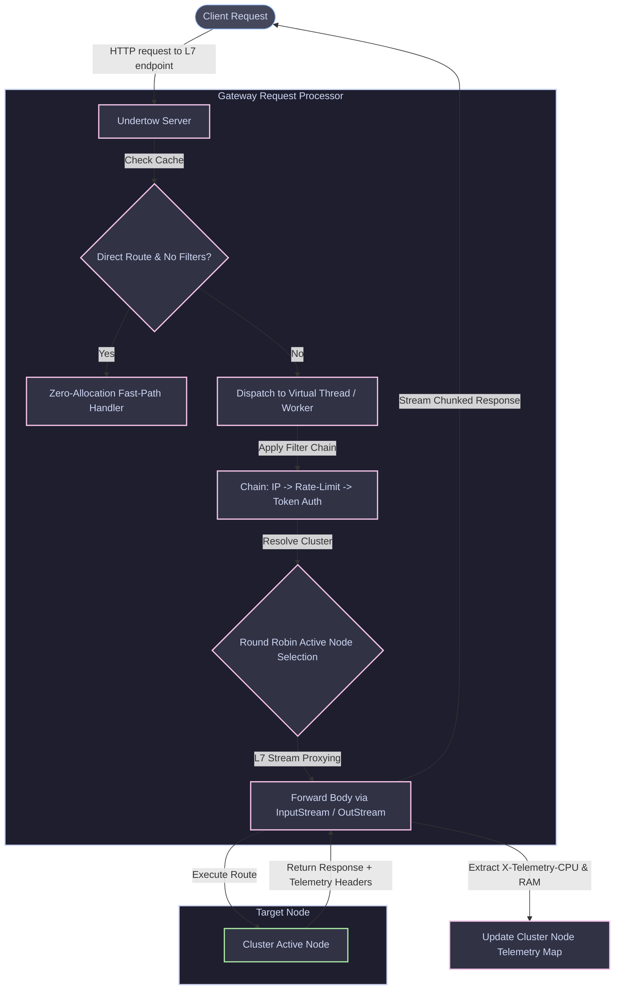
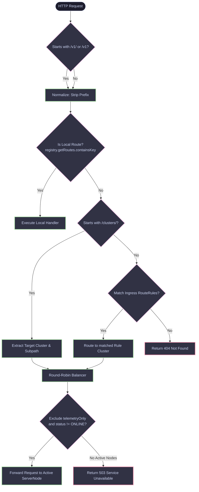
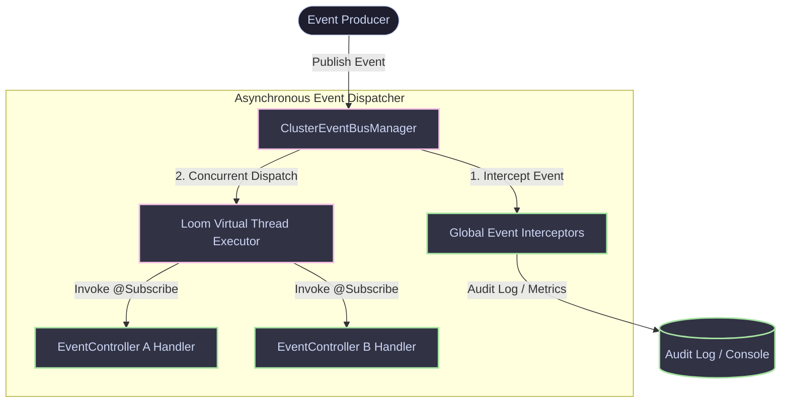
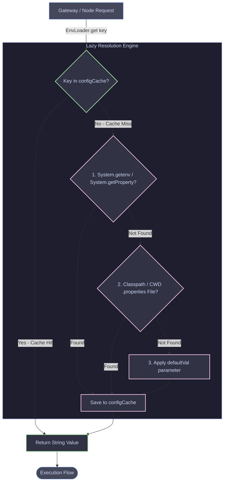
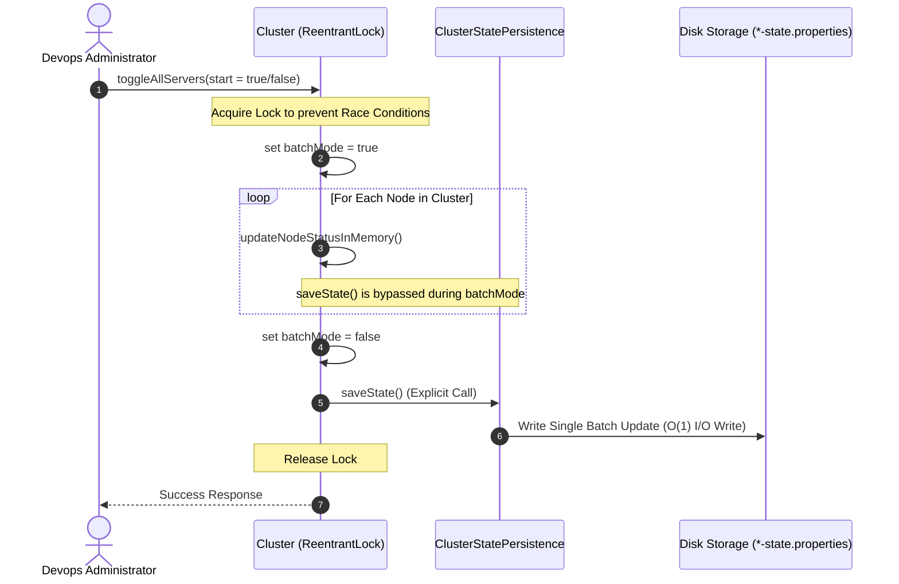
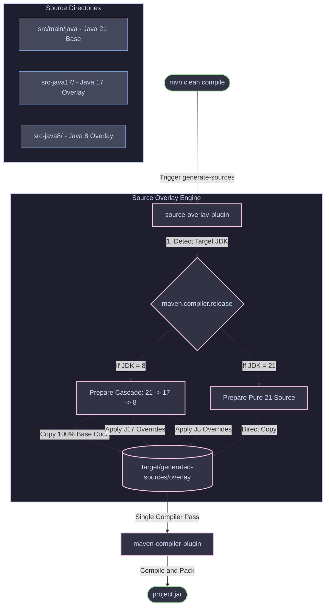

# GateBridge

[](https://openjdk.org/)
[](https://openjdk.org/projects/jdk/11/)
[](https://openjdk.org/projects/jdk/17/)
[](https://openjdk.org/projects/jdk/21/)
[](https://maven.apache.org/)
[](LICENSE)

GateBridge is a lightweight Java cluster gateway framework featuring multi-protocol transports, Loom-based virtual threading (with seamless Java 8 compatibility overlays), dynamic autodiscovery, and an interactive DevOps TUI telemetry console.

---

## 🚀 Key Framework Services & Capabilities

GateBridge offers a complete suite of modular internal services designed to run on resource-constrained environments (like 1GB RAM vCPUs):

### 1. Multi-Protocol Gateway Transports (`ServerManager`)
The framework can run four independent network services concurrently on a single base port:
*   **Telnet Server:** High-speed line-based command execution port using raw sockets.
*   **HTTP REST Server:** Exposes JSON APIs for metrics, cluster node lists, and control loops (runs on `base_port + 1`).
*   **WebSocket Stream Server:** Pushes real-time JSON event streams (telemetry updates, node status changes) to clients (runs on `base_port + 2`).
*   **TCP Proxy Load-Balancer:** Raw Layer 4 network load-balancer tunneling bytes bidirectionally to active cluster nodes using virtual threads (runs on `base_port + 3`).

**Multi-Protocol Gateway Flow:**
This diagram illustrates how the `ServerManager` listens on the base physical port and dispatches connections concurrently and independently.



### 2. Layer 7 HTTP Reverse Proxy Load-Balancer

The HTTP REST Server (on `base_port + 1`) acts as a Layer 7 reverse proxy. When a client requests `/clusters/{clusterName}/{path}`, GateBridge automatically:

* Resolves the target cluster and selects an online node using thread-safe, overflow-safe Round-Robin index selection.
* Proxies the HTTP method, headers, and body, streaming the response back using chunked transfer encoding (`Transfer-Encoding: chunked`) to avoid memory-buffering OOM vulnerabilities.
* Passively measures connection latency and extracts CPU/RAM telemetry from response headers (`X-Telemetry-CPU`, `X-Telemetry-RAM`) to update node metrics dynamically.

**L7 Reverse Proxy & Passive Telemetry Extraction Flow:**



### 3. Layer 4 TCP Tunneling Load-Balancer

The TCP Proxy (on `base_port + 3`) performs raw layer 4 connection load-balancing, forwarding TCP streams bidirectionally using virtual threads. It supports robust TCP half-close sequences via output shutdown, preserving active connections while recovering immediately on EOF or socket errors.

### 4. Virtual Thread Concurrency Engine (`ThreadManager`)

GateBridge leverages **Java 21 Virtual Threads (Loom)** for lightweight asynchronous execution:

* **Zero OS Thread Spawning:** Spawns virtual threads inside JVM Heap memory instead of heavy OS kernel threads.
* **Fixed Thread Footprint:** The entire JVM stays constrained to exactly **9 platform OS threads** (6 base JVM threads + 3 carrier threads), regardless of how many concurrent WebSocket clients connect or pings are scheduled.
* **Virtual Schedulers:** Scheduled tasks (like health pings) run on virtual thread executors, yielding the physical CPU core when sleeping (`0% CPU idle footprint`).

### 5. Customizable Route Controllers & Routing Resolution Flow

Expose new cluster commands and REST/Telnet APIs dynamically. Developers create classes implementing `RouteController` and annotate target handler methods with `@RouteMapping`:

```java
public class MyCustomController implements RouteController {
    @RouteMapping("HELLO")
    public void sayHello(String args, PrintWriter out) {
        out.println("Hello, " + (args.isEmpty() ? "World" : args));
    }
}

```

At startup, GateBridge scans the classpath and registers these mapped commands automatically.

**Routing & Ingress Route Rules Resolution Flow:**
This diagram shows how incoming HTTP requests are normalized and resolved with local route precedence to prevent shadowing by Ingress wildcard rules:



### 6. Custom Events Subsystem & Telemetry Event Dispatch Flow

GateBridge supports typed custom events using simple Java `record` declarations:

```java
// Define a custom event payload
public record OrderProcessedEvent(String orderId, double amount) implements Event {}

// Create a listener controller
public class OrderListener implements EventController {
    @Subscribe
    public void onOrderProcessed(OrderProcessedEvent event) {
        System.out.println("Processing order: " + event.orderId());
    }
}

```

Listeners are autodiscovered on startup and bound to the global Event Bus.

**Custom Events Subsystem Flow:**
This diagram shows how custom events are published, intercepted for auditing, and dispatched concurrently to autodiscovered listeners using Loom's lightweight virtual threads:



**Showcase Application Custom Routes and Listeners Flow:**
This diagram illustrates the custom event listeners and custom routes defined in the reference [MinimalApplication.java](file:///home/watashi/Projects/Java-framework/gatebridge/gatebridge/java/src/hexacloud/application/MinimalApplication.java) showcase:

```mermaid
graph TD
    %% Nodes and Connections
    subgraph CustomApp [Minimal Application Demo Showcase]
        subgraph Routes [DemoRouteController - Custom Routes]
            HELLO[Route: HELLO] -->|Returns| HelloResp["HELLO FROM MINIMAL APPLICATION ROUTE!"]
            SYSINFO[Route: SYSTEM_INFO] -->|Returns| SysInfoResp["GateBridge Status: ACTIVE + CPU Info"]
        end
        
        subgraph Events [DemoEventController - Custom Listeners]
            DevEvent[DeveloperCustomEvent] -->|@Subscribe| H1[onDeveloperEvent]
            StatusEvent[NodeStatusChanged] -->|@Subscribe| H2[onNodeStatusChanged]
            TelemEvent[NodeTelemetryUpdated] -->|@Subscribe| H3[onNodeTelemetryUpdated]
            SubEvent[NodeEventSubmitted] -->|@Subscribe| H4[onNodeEventSubmitted]
            
            H1 -->|stdout| Log1["[EVENT] Developer Custom Event Received: ..."]
            H2 -->|stdout| Log2["[EVENT] Node Status Changed -> Host: ..."]
            H3 -->|stdout| Log3["[EVENT] Telemetry Updated for Node: ..."]
            H4 -->|stdout| Log4["[EVENT] Custom Node Event -> Host: ..."]
        end
    end

    %% Styles
    classDef step fill:#1e1e2e,stroke:#cdd6f4,stroke-width:1px,color:#cdd6f4;
    classDef custom fill:#313244,stroke:#f5c2e7,stroke-width:2px,color:#cdd6f4;
    classDef output fill:#313244,stroke:#a6e3a1,stroke-width:2px,color:#cdd6f4;

    class HELLO,SYSINFO,DevEvent,StatusEvent,TelemEvent,SubEvent custom;
    class H1,H2,H3,H4 custom;
    class HelloResp,SysInfoResp,Log1,Log2,Log3,Log4 output;
    class CustomApp,Routes,Events step;
```


### 7. Dynamic Autodiscovery Engine (Zero Configuration)

Eliminates manual bootstrapping:

* **Route Auto-Discovery:** Automatically scans the classpath for classes implementing `RouteController` and registers their mappings.
* **Event Auto-Discovery:** Automatically scans the classpath for classes implementing `EventController` and binds `@Subscribe` handlers.
* **Package-Scoped Scanning:** Restricts classpath scanning to the main application package to maintain sub-millisecond startup times.

### 8. Hierarchical Configuration Resolution & Lazy Caching (`EnvLoader`)

`EnvLoader` implements the **12-Factor App** guidelines for externalized configuration. It searches variables in a strict order of precedence (System/Env Overrides > Classpath > CWD) and caches the resolved values in a thread-safe `ConcurrentHashMap` to achieve sub-microsecond lookups without CPU waste.



### 9. Programmatic Fluent API & Nested Node Builders

Configure gateways and nodes programmatically without properties files:

```java
// Create a named Gateway for a named Cluster
GatewayBuilderPort builder = GatewayFactory.createGateway("gateway-1", "my-cluster")
    .port(3000)
    .requireToken(true, "secret-token")
    .rateLimit(100, 60)
    .allowedIps("127.0.0.1")
    .enableTcpProxy(true); // Enable L4 TCP proxy load-balancing

// Configure Cluster Routing Mode
builder.getCluster().setRoutingMode(Cluster.RoutingMode.HYBRID);

// Register a named node using the fluent builder
builder.registerNode("node-a", "http://node-a", 8080)
    .pingEnabled(true)
    .pingPath("/healthz")
    .pingHeader("Authorization", "Bearer token-abc")
    .register();

// Start listeners and explicitly launch health check pings
RunningGatewayPort gateway = builder.listen().startPingScheduler();

```

### 10. Thread-Safe Batch-Mode State Persistence (`Cluster` & `ClusterStatePersistence`)

GateBridge prevents concurrent data corruption (*Race Conditions*) and high disk I/O latency bottlenecks during batch node operations (e.g., toggling 100 servers). By acquiring a `ReentrantLock` and setting `batchMode = true`, it updates memory structures instantly and commits to the local properties file only once at the end.



### 11. Asynchronous Health Ping Scheduler

* Decoupled, multi-threaded node monitoring via customizable HTTP/TCP health checks.
* Supports custom ping paths, custom headers, and external/internal node flags.
* Dispatches lifecycle event bus triggers immediately on node status transitions.

### 12. Global Event Bus & Interceptor Subsystem

* Lightweight, high-performance publish-subscribe event system.
* Exposes **Global Event Interceptors** to capture, audit, or log all dispatched events globally, providing real-time hooks for logging and metrics.

**Event Bus & Telemetry Dispatch Flow:**
Demonstrates how the asynchronous ping scheduler (`ThreadPingScheduler`) triggers the multi-protocol adapter and distributes data through the event bus without blocking execution or generating unnecessary event flooding.

```mermaid
sequenceDiagram
    autonumber
    participant TPS as ThreadPingScheduler
    participant MPA as MultiProtocolPingAdapter
    participant Node as Cluster Node
    participant EB as ClusterEventBusManager
    participant TUI as DevOps TUI Dashboard
    participant WS as WebSocket Server
    participant Interceptors as Global Event Interceptors

    rect rgb(30, 30, 46)
        Note over TPS, Node: Asynchronous Health Check Cycle (Project Loom)
        loop Ping Interval (Seconds)
            TPS->>MPA: fetchPingAsync(clusterName, node)
            MPA->>Node: Physical Ping (HTTP / TCP / WebSocket / UDP / gRPC)
            Node-->>MPA: Return Telemetry / Status Payload
            MPA-->>TPS: Deliver PingResult (Status, Telemetry)
        end
    end

    rect rgb(49, 50, 68)
        Note over TPS, Interceptors: Event Processing & Distribution (Pub/Sub)
        
        alt Status Transition (e.g. ONLINE <-> OFFLINE)
            TPS->>EB: dispatch(NodeStatusChanged)
        end

        alt New Telemetry Available (hasTelemetry)
            TPS->>EB: dispatch(NodeTelemetryUpdated)
        end

        par Concurrent Dispatch
            EB->>TUI: Update Metrics Dashboard & Event Feed
        and
            EB->>WS: Broadcast JSON Payload to Connected Clients
        and
            EB->>Interceptors: Capture Event for Global Auditing / Logging
        end
    end

```



### 13. Compile-Time Source Overlay Build Flow

The custom **Source Overlay Maven Plugin** implements **Cascading Version Inheritance** during the `generate-sources` phase. It merges Java 8, 17, and 21 codebase overlays deterministically so that the Maven compiler only needs to run a single compilation pass.



### 14. DevOps Terminal UI Dashboard (TUI)

An interactive command center for cluster operations:

* **Live Metrics:** Real-time system resources monitor (RAM Allocation/Usage, CPU, and Thread breakdown).
* **Explicit Thread Classification:** Displays exactly how many OS threads belong to the application logic versus internal JVM daemon services (e.g. `OS Threads: 9 (App: 1)`).
* **Recent Events Feed:** Renders dispatched system and custom events dynamically with live relative time tracking (e.g. `[2s] NodeReg: localhost:3001`).
* **Log Redirection:** Redirects global `System.out` and `System.err` prints into the TUI logs panel to prevent terminal window corruption.
* **On-Demand Toggle Mode (`startToggleMode`):** Detach the dashboard anytime (resuming standard console stdout log outputs) and reattach dynamically by pressing `ENTER`.

---

## 📦 Project Structure

* `java/src/hexacloud/application/MinimalApplication.java` — Example standalone application demonstrating programmatic bootstrapping, custom routes, and custom event listeners running in headless and toggle TUI mode.
* `java/src/hexacloud/application/TerminalMain.java` — Bootstraps a gateway and starts the interactive DevOps Panel.
* `java/src/hexacloud/core/ports/` — Declares clean segregation boundaries: `GatewayBuilderPort` (configuration) and `RunningGatewayPort` (runtime control).
* `java/src/hexacloud/core/tui/` — Subsystem for rendering, key handling, and input scanner loops.
* `java/src/hexacloud/core/utils/ThreadManager.java` — Core virtual thread wrapper class.

---

## 🚀 Quickstart

Compile and start the DevOps interactive terminal console:

```bash
./show_case/run_terminal.sh
```

---

## 📖 Documentation

Review the detailed module guides:

*   [Overview](docs/index.md#overview)
*   [Gateway & Node Configurations](docs/gateway.md)
*   [Terminal UI Dashboard Guides](docs/terminal-ui.md)
*   [Concurrency & ThreadManager API](docs/thread-manager.md)
*   [Custom Events API](docs/events.md)
*   [Framework Extensibility Guide](docs/framework-extensibility.md)
*   [Examples & Client Showcase](docs/examples.md)

---

## License

This project is licensed under the MIT License. See [LICENSE](https://www.google.com/search?q=LICENSE).

---

Created and maintained by watashi-00 (watashi00 | Rodrigo).
